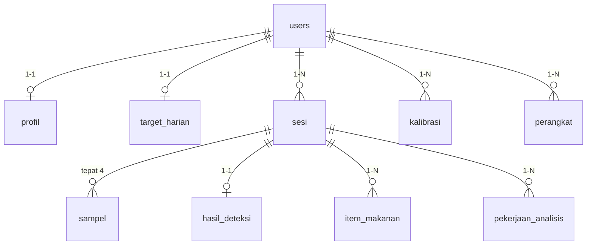

# AsaWatch Backend — Database & Alur Kerja

Dokumen ini menjelaskan isi database dan alur kerja backend AsaWatch apa adanya
sesuai kode di repo ini (Laravel 12, PHP 8.2). Rujukan "bagian N dokumen API"
yang muncul di komentar kode mengacu ke dokumen kontrak API yang **tidak ada di
repo ini**; dokumen ini hanya mendeskripsikan yang benar-benar terimplementasi.

---

## 1. Gambaran Umum

Backend melayani dua konsumen dari satu basis data yang sama:

| Konsumen | Prefix | Autentikasi | Format |
|---|---|---|---|
| Aplikasi mobile (Flutter, offline-first) | `/api/v1/*` | Sanctum bearer token | JSON |
| Panel admin/peneliti | `/admin/*` | Session + cookie (`auth` web guard) | Blade + Bootstrap 5 |

Keduanya memakai tabel `users` yang sama — tidak ada tabel admin terpisah dan
tidak ada kolom peran. Peran administrator ditentukan oleh satu metode:

```php
public function isAdmin(): bool
{
    return $this->email === 'admin@asawatch.com';   // App\Models\User
}
```

Jadi ada dua kelas pengguna:

- **Pengguna biasa** — hanya melihat datanya sendiri di seluruh panel.
- **Administrator** (`admin@asawatch.com`) — menembus kedua lapis otorisasi dan
  bisa menelusuri data seluruh pengguna lewat menu "Daftar Pengguna".
  Rinciannya di [bagian 6](#6-lapisan-keamanan) dan [bagian 7](#7-alur-kerja-panel-admin).

Konsep inti domain adalah **sesi makan**: pengguna memotret makanan, lalu jam
tangan mengambil 4 sampel biometrik di sekitar waktu makan itu (baseline sebelum
makan, saat makan, +1 jam, +2 jam). Foto dianalisis untuk memperkirakan
kandungan nutrisi dan indeks glikemik.

---

## 2. Skema Database

### 2.1 Peta relasi



Semua foreign key ke `users.id` dan ke `sesi.id` memakai `cascadeOnDelete` di
level database. Artinya satu `forceDelete()` pada `User` membersihkan seluruh
turunannya secara berantai (dimanfaatkan oleh `HapusAkunJob`).

### 2.2 `users`

| Kolom | Tipe | Catatan |
|---|---|---|
| `id` | bigint PK | auto increment |
| `nama` | string | bukan `name` — kolom bawaan Laravel diubah |
| `email` | string unique | |
| `email_verified_at` | timestamp nullable | wajib terisi untuk semua endpoint di balik middleware `verified` |
| `password` | string | cast `hashed` |
| `remember_token`, `timestamps`, `deleted_at` | | `SoftDeletes` aktif |

`User` mengimplementasikan `MustVerifyEmail` dan memakai `HasApiTokens`
(Sanctum). Notifikasi reset sandi di-override ke
`AturUlangSandiNotification` supaya isi emailnya berbahasa Indonesia.

### 2.3 `profil` dan `target_harian`

Keduanya berbagi pola yang sama: **primary key-nya adalah `user_id`** (relasi
1-1 yang ditegakkan di level skema, bukan sekadar konvensi).

`profil`: `tanggal_lahir` (date), `jenis_kelamin` (enum `laki-laki|perempuan`),
`golongan_darah` (enum `A|B|AB|O`), `tinggi_cm` (smallint), `berat_kg`
(decimal 5,2). Semua nullable — profil kosong itu sah.

`target_harian`: `kalori`, `karbohidrat`, `langkah`. Semua nullable.

Karena baris ini boleh belum ada, controller-nya (`ProfilController`,
`TargetHarianController`) mengembalikan **instance model kosong yang belum
tersimpan** ketika relasinya null, supaya bentuk respons JSON tetap konsisten.

### 2.4 `sesi` — tabel pusat

| Kolom | Tipe | Catatan |
|---|---|---|
| `id` | **uuid PK** | **dibuat klien**, bukan server |
| `user_id` | FK users, cascade | |
| `foto_disk_path` | string nullable | path relatif di disk privat `local` |
| `foto_hash` | string nullable, **indexed** | SHA-256 isi file; kunci cache analisis |
| `waktu_foto` | timestampTz | wajib |
| `t0` | timestampTz nullable | titik nol pengukuran (mulai makan) |
| `status` | string | `draft`, `menunggu_perangkat`, `berjalan`, `selesai`, `tidak_lengkap`, `dibatalkan` |
| `waktu_tidak_pasti` | boolean default false | penanda jam perangkat tidak sinkron |
| `timestamps` + `deleted_at` | | `SoftDeletes` — dibutuhkan agar penghapusan bisa ikut tersinkron |

Index: `(user_id, updated_at)` untuk cursor sinkronisasi, `(user_id, t0)` untuk
kueri kronologis.

> **Penting:** `Sesi` diset `$incrementing = false`, `$keyType = 'string'`, dan
> `id` masuk `$fillable`. ID selalu datang dari aplikasi mobile sebagai UUID v4
> — inilah yang membuat pola offline-first bisa jalan (klien bisa membuat sesi
> tanpa jaringan, lalu mengirimkannya belakangan dengan ID yang sudah final).

### 2.5 `sampel` — 4 titik pengukuran per sesi

**Primary key komposit `(sesi_id, index)`**, dengan `index` bernilai 0–3.

| Kolom | Catatan |
|---|---|
| `index` | 0 = baseline, 1 = t0, 2 = +1 jam, 3 = +2 jam |
| `detik_relatif_t0` | offset kanonis: `-1800, 0, 3600, 7200` |
| `status` | `menunggu`, `terisi`, `terlewat` |
| `dari_buffer` | boolean — data dikirim dari buffer perangkat, bukan realtime |
| `gula_darah`, `detak_jantung`, `sistolik`, `diastolik`, `spo2` | integer nullable |

> Eloquent tidak mendukung primary key komposit. Model `Sampel` "berbohong"
> dengan menyatakan `$primaryKey = 'sesi_id'`, jadi **jangan pernah pakai
> `find()` atau `save()` berbasis key** pada model ini — selalu
> `where('sesi_id', …)->where('index', …)` seperti yang dilakukan
> `PenggabungSesi::terapkanSampel()`.

### 2.6 `hasil_deteksi` dan `item_makanan` — output analisis foto

`hasil_deteksi` (PK = `sesi_id`, jadi 1-1 dengan sesi):
`indeks_glikemik_perkiraan` (string), `keyakinan` (float),
`dikoreksi_user` (boolean), lalu total nutrisi:
`total_kalori`, `total_karbohidrat`, `total_protein`, `total_lemak`,
`total_gula_total`, `total_serat`.

`item_makanan` (PK komposit `(sesi_id, urutan)`): rincian per makanan yang
terdeteksi — `nama`, `porsi`, `estimasi_gram`, dan enam kolom nutrisi yang sama
tanpa prefix `total_`.

Perhatikan `item_makanan.sesi_id` menempel ke **sesi**, bukan ke
`hasil_deteksi`, walau relasi Eloquent `hasilDeteksi.itemMakanan` sering dipakai
saat eager loading.

### 2.7 `pekerjaan_analisis` — status pekerjaan asinkron

`id` (uuid PK), `sesi_id` (FK cascade, indexed), `status`
(`antre` | `selesai` | `gagal`), `kode_galat` (nullable, isinya dari
`App\Support\KodeAnalisis`), `percobaan` (tinyint, default 0).

Satu sesi bisa punya banyak baris pekerjaan (setiap permintaan analisis membuat
baris baru); yang dibaca klien selalu yang `latest('created_at')`.

### 2.8 `kalibrasi` dan `perangkat`

`kalibrasi` (uuid PK, `HasUuids`): `waktu`, `sistolik_referensi`,
`diastolik_referensi`, `sistolik_jam`, `diastolik_jam`. Ada
`unique(user_id, waktu)` — satu kalibrasi per titik waktu per pengguna. Isinya
adalah pasangan pembacaan tensimeter referensi vs pembacaan jam tangan pada
momen yang sama, dasar untuk mengoreksi bias perangkat.

`perangkat` (uuid PK): `id_ble` (identitas Bluetooth), `nama`, `firmware`,
`baterai_terakhir`, `terakhir_tersambung`. Ada `unique(user_id, id_ble)` —
inilah kunci alami yang dipakai endpoint upsert, bukan `id`.

### 2.9 Tabel infrastruktur

`personal_access_tokens` (Sanctum, masa berlaku default 30 hari via
`SANCTUM_TOKEN_EXPIRATION_MINUTES`), `password_reset_tokens`, `sessions`
(`SESSION_DRIVER=database`), `cache`, `jobs`/`job_batches`/`failed_jobs`
(`QUEUE_CONNECTION=database`).

---

## 3. Autentikasi & Siklus Hidup Akun

### 3.1 Pendaftaran

```
POST /api/v1/auth/daftar  { nama, email, kata_sandi, nama_perangkat }
  → User::create (password auto-hash)
  → event Registered → email verifikasi terkirim
  → createToken(nama_perangkat) → token dikembalikan langsung
  → 201 { data: { token, profil } }
```

Token diberikan **sebelum** email diverifikasi. Jadi klien bisa menyimpan token,
tapi seluruh endpoint data ada di balik middleware `['auth:sanctum', 'verified']`
dan akan menolak sampai email diverifikasi. Yang tetap bisa diakses tanpa
verifikasi hanyalah grup `auth/*` (keluar, kirim ulang verifikasi, `saya`,
hapus akun).

`nama_perangkat` menjadi nama token — inilah yang memungkinkan
"keluar dari perangkat ini" vs "keluar dari semua perangkat".

### 3.2 Verifikasi email

Tautan di email mengarah ke `GET /email/verify/{id}/{hash}` di **routes web**,
bukan API — karena dibuka di browser HP, bukan dipanggil aplikasi. Keamanannya
dari middleware `signed` + pencocokan `sha1(email)`. Setelah sukses, halaman
teks biasa meminta pengguna kembali ke aplikasi.

### 3.3 Masuk, keluar, lupa sandi

- `POST /auth/masuk` — dibatasi `throttle:masuk` (5/menit per kombinasi
  email+IP). Email salah dan sandi salah menghasilkan pesan yang **identik**
  supaya tidak membocorkan email mana yang terdaftar.
- `POST /auth/keluar` menghapus token yang sedang dipakai;
  `keluar-semua` menghapus seluruh token pengguna.
- `POST /auth/lupa-sandi` — `throttle:lupa-sandi`, dan **selalu** membalas 202
  dengan pesan netral, ada atau tidak email tersebut.
- `POST /auth/atur-ulang-sandi` — setelah sandi diganti, **semua token dicabut**.

### 3.4 Penghapusan akun (dua tahap)

```
DELETE /api/v1/auth/akun  { kata_sandi }
  → verifikasi ulang kata sandi
  → semua token dihapus  (akses dicabut seketika)
  → $user->delete()      (soft delete)
  → HapusAkunJob dijadwalkan +7 hari
  → email konfirmasi terkirim
  → 202
```

Setelah 7 hari `HapusAkunJob` berjalan. Job ini **berhenti diam-diam** jika
pengguna sudah tidak trashed (mis. sempat dipulihkan). Kalau lanjut, ia
mengumpulkan seluruh `foto_disk_path` lebih dulu, lalu `forceDelete()` sang
User — cascade database membereskan semua tabel turunan — dan terakhir menghapus
file foto dari disk. Dua hal yang tidak ikut cascade dan karenanya diurus
manual: token Sanctum (relasi polimorfik, bukan FK sungguhan) dan file di
storage.

---

## 4. Alur Kerja Utama: Sesi Makan

### 4.1 Perjalanan satu sesi

```
[APLIKASI MOBILE — bisa sepenuhnya offline]
  1. Pengguna memotret makanan
     → app membuat UUID v4 sendiri, status "draft"
  2. Jam tangan mengambil sampel index 0..3 di sekitar t0
     → disimpan lokal, ditandai dari_buffer bila diambil belakangan

[SAAT ADA JARINGAN]
  3. PUT  /api/v1/sesi/{uuid}          (satu sesi)
     atau POST /api/v1/sinkron          (batch)
     → keduanya masuk ke PenggabungSesi::gabungkan()
  4. POST /api/v1/sesi/{uuid}/foto     (multipart, maks 10 MB, harus image)
     → disimpan ke disk privat, foto_hash dihitung
  5. POST /api/v1/sesi/{uuid}/analisis (throttle: 20/jam per user)
     → 202 { status: "antre", id_pekerjaan }
  6. GET  /api/v1/sesi/{uuid}/analisis (polling)
     → { status, kode, hasil }
  7. GET  /api/v1/sinkron?sejak=…      (tarik perubahan dari server)
```

Langkah 3 dan 4 sengaja dipisah: kalau unggah foto gagal (jaringan seluler
putus di tengah), klien cukup mengulang langkah 4 tanpa mengirim ulang seluruh
payload sesi.

### 4.2 Aturan penggabungan (`PenggabungSesi`)

Ini jantung sistem dan **satu-satunya** tempat aturan konflik hidup. Seluruh
operasinya berjalan di dalam `DB::transaction` dengan `lockForUpdate()` pada
baris sesi, jadi dua pengiriman bersamaan tidak saling menimpa separuh jalan.

| # | Aturan | Implementasi |
|---|---|---|
| 1 | Sampel yang sudah `terisi` **tidak pernah** ditimpa | `terapkanSampel()` langsung `return` (dan menulis log info) bila baris eksisting berstatus `terisi` — bukan melempar error, karena klien yang mengirim ulang batch lama tidak sedang berbuat salah |
| 2 | Selebihnya *last-write-wins* per sesi | `diperbarui_pada` dari klien dibandingkan dengan `updated_at` server; klien yang lebih tua ditolak `409 konflik_versi` |
| 3 | Penghapusan mengalahkan pembaruan | sesi yang sudah soft-deleted tidak bisa dihidupkan lagi; jika payload membawa `dihapus_pada`, sesi ikut dihapus |
| 4 | `waktu_tidak_pasti` tidak pernah dicabut server | `$sesi->waktu_tidak_pasti = lama \|\| baru` — sekali true, selamanya true |

Saat sesi **baru** dibuat, `buatSlotSampelAwal()` langsung menulis 4 baris
`sampel` berstatus `menunggu` pada offset kanonis
`[-1800, 0, 3600, 7200]` detik. Tujuannya: `GET` selalu mengembalikan tepat 4
elemen, sehingga UI klien tidak perlu menangani kasus "array setengah jadi".
Nilai offset ini akan ditimpa begitu pengukuran sungguhan dikirim — selama slot
tersebut belum `terisi`.

Hasil `gabungkan()` berupa
`{status: 'diterima'|'ditolak', kode?, pesan?, sesi?}`. `SesiController::upsert`
menerjemahkan `ditolak` menjadi `ApiException` 409; `SinkronController::store`
mengumpulkannya ke dalam daftar `ditolak` per-item tanpa menggagalkan batch.

### 4.3 Sinkronisasi dua arah

**Tarik** — `GET /api/v1/sinkron?sejak=<iso>&limit=<n>` (limit dibatasi maks
500). Kursor berbasis `updated_at`, bukan nomor halaman:

```json
{
  "data": { "sesi": [...], "kalibrasi": [...], "profil": {...}|null },
  "meta": { "kursor_berikutnya": "2026-08-18T…Z", "ada_lagi": true }
}
```

Sesi diambil `withTrashed()` — penghapusan harus ikut terkirim, kalau tidak
klien offline tidak akan pernah tahu ada sesi yang dihapus dari perangkat lain.
`ada_lagi` ditentukan dengan trik ambil `limit + 1` baris. `profil` hanya
disertakan bila `updated_at`-nya lebih baru dari `sejak`.

**Dorong** — `POST /api/v1/sinkron` dengan payload
`{ data: { sesi: [...], kalibrasi: [...], profil: {...} } }`. Sesi lewat
`PenggabungSesi`; kalibrasi lewat `updateOrCreate` pada kunci
`(user_id, waktu)`; profil lewat `updateOrCreate` pada `user_id`. Respons:
daftar `diterima` (berisi ID) dan `ditolak` (berisi ID + kode + pesan), jadi
sebagian batch boleh gagal tanpa membatalkan sisanya.

### 4.4 Foto: tidak pernah punya URL publik

Foto disimpan di disk `local` (`storage/app/private/foto/{user_id}/{sesi_id}.ext`)
yang **tidak** di-serve web server. Satu-satunya jalan mengaksesnya adalah
`GET /api/v1/foto/{sesi}`, yang dijaga tiga lapis sekaligus: middleware
`signed`, `auth:sanctum`, dan `SesiPolicy::view`.

`SesiResource` menghasilkan URL bertanda tangan berumur **1 jam** setiap kali
sesi diserialisasi, lengkap dengan `kadaluarsa_pada` agar klien tahu kapan harus
meminta ulang.

### 4.5 Pipeline analisis nutrisi

`AnalisisNutrisiJob` (`tries = 3`, `timeout = 30` detik, backoff `[5, 15, 30]`):

```
1. Muat PekerjaanAnalisis; kalau hilang → berhenti diam-diam
2. Muat Sesi dengan withoutGlobalScopes()   ← wajib: di queue tidak ada auth user
3. Tidak ada foto?                → status "gagal", kode layanan_nutrisi_gagal
4. hasil_deteksi.dikoreksi_user?  → status "selesai" TANPA menulis apa pun
5. Cache: ada sesi lain dengan foto_hash sama & sudah punya hasil?
       ya  → pakai hasil itu (provider tidak dipanggil)
       tidak → LayananVisionNutrisi::analisis(path absolut foto)
6. Dalam satu transaksi:
       updateOrCreate hasil_deteksi
       hapus semua item_makanan sesi ini, tulis ulang dari hasil
7. status "selesai"
```

Tiga keputusan desain yang penting di sini:

- **Koreksi pengguna menang.** Kalau pengguna sudah membetulkan hasil deteksi,
  job yang selesai belakangan tidak boleh menimpanya.
- **Gagal itu status, bukan exception.** `LayananNutrisiGagalException`
  ditangkap dan diubah menjadi `pekerjaan.status = 'gagal'` + `kode_galat`.
  Sesi tanpa hasil nutrisi tetap sesi yang sah — data biometriknya tidak ikut
  rusak.
- **Cache berdasarkan isi file.** Dua sesi dengan foto identik hanya memanggil
  provider sekali.

Kalau job habis percobaan, hook `failed()` menandai pekerjaan `gagal` dengan
kode `waktu_habis`.

`LayananVisionNutrisi` adalah **interface** dengan satu implementasi terikat di
`AppServiceProvider`: `StubLayananVisionNutrisi`, yang mengembalikan hasil
tetap berlabel "Makanan belum dikenali (mode pengembangan)". **Belum ada
penyedia vision sungguhan yang terpasang.** Mengganti ke provider asli idealnya
cukup mengubah satu baris binding tersebut.

---

## 5. Kontrak Respons API

**Sukses** — selalu lewat API Resource di `app/Http/Resources/Api/V1/`, dibungkus
`data`. Semua timestamp melewati `App\Support\Waktu::iso()` yang menghasilkan
ISO-8601 UTC dengan mikrodetik (`2026-08-12T04:30:00.000000Z`). Tidak ada
format tanggal kedua di kode ini — jangan membuat satu.

**Galat** — seluruh kegagalan pada `api/*` diserialisasi oleh handler di
`bootstrap/app.php` menjadi bentuk yang sama:

```json
{ "galat": { "kode": "validasi_gagal", "pesan": "…", "detail": { … } } }
```

Pemetaannya:

| Exception | Kode | HTTP |
|---|---|---|
| `ApiException` | apa pun yang dibawa | apa pun yang dibawa |
| `ValidationException` | `validasi_gagal` | 422 |
| `AuthenticationException` | `tidak_terautentikasi` | 401 |
| `AuthorizationException` | `tidak_diizinkan` | 403 |
| `ModelNotFound` / `NotFound` | `tidak_ditemukan` | 404 |
| `TooManyRequests` | `terlalu_sering` | 429 |
| `HttpException` lain | `galat_server` | status aslinya |
| `Throwable` (saat debug mati) | `galat_server` | 500 |

Konflik sinkronisasi memakai `konflik_versi` (409). Nilai-nilai ini didefinisikan
di `App\Support\KodeGalat` dan menjadi **kosakata tetap yang di-branch aplikasi
mobile**: menambah kode baru aman, mengubah arti kode lama tidak.

`App\Support\KodeAnalisis` adalah kosakata terpisah untuk hasil pekerjaan
analisis (`foto_tidak_dikenali`, `layanan_nutrisi_gagal`, `waktu_habis`) — bukan
galat HTTP. Nilai `layanan_nutrisi_gagal` sengaja sama persis di kedua kelas.

---

## 6. Lapisan Keamanan

1. **Middleware rute** — `auth:sanctum` + `verified` pada seluruh grup data.
2. **Policy eksplisit** — `SesiPolicy` (`view`/`update`/`delete`) dipanggil
   manual di setiap controller yang menerima model `Sesi`.
3. **Global scope `OwnedByAuthUserScope`** — terpasang pada `Sesi` dan
   `Kalibrasi`, otomatis menambahkan `where user_id = auth()->id()` pada setiap
   kueri **selama request HTTP**, dan dilewati saat `runningInConsole()`.

**Administrator menembus lapis 2 dan 3.** `OwnedByAuthUserScope` langsung
`return` bila `auth()->user()->isAdmin()`, dan setiap metode `SesiPolicy`
diawali `$user->isAdmin() ||`. Keduanya **tidak dibatasi ke rute `/admin/*`** —
pemeriksaannya murni pada identitas pengguna, bukan pada konteks request.
Artinya bila akun admin masuk lewat API dengan token Sanctum, pelebaran akses
itu ikut berlaku di sana: `GET /api/v1/sesi` (yang mengandalkan global scope,
bukan filter `user_id` eksplisit) akan mengembalikan sesi milik semua pengguna,
dan `GET /api/v1/foto/{sesi}` akan meloloskan foto makanan siapa pun.
Pertimbangkan ini sebelum memakai `isAdmin()` di tempat baru.

Lapis 2 dan 3 sengaja rangkap (*defense in depth*): scope menutup kebocoran
akibat kueri yang lupa difilter, policy menutup kasus scope tidak aktif.
Karena scope mati di konteks queue/console, kode di sana harus memanggil
`withoutGlobalScopes()` secara sadar — itulah yang dilakukan
`AnalisisNutrisiJob`, `PenggabungSesi`, dan `HapusAkunJob`.

**Rate limiter** didefinisikan di `AppServiceProvider::boot()`:

| Nama | Batas | Kunci |
|---|---|---|
| `masuk` | 5 / menit | email + IP |
| `lupa-sandi` | 5 / menit | email + IP |
| `analisis` | 20 / jam | user id (fallback IP) |

---

## 7. Alur Kerja Panel Admin

Semua di bawah `/admin`, dengan `AuthController` berbasis session
(`Auth::attempt` + `session()->regenerate()`), bukan token.

| Rute | Isi |
|---|---|
| `admin.dashboard` | KPI: total sesi, sesi selesai, rata-rata gula darah hari ini, jumlah perangkat, kalibrasi terakhir, plus daftar sampel "perlu perhatian" |
| `admin.responden.index` | Riwayat sesi (paginasi 10, filter status) |
| `admin.responden.show` | Detail satu sesi: 4 sampel, hasil deteksi, item makanan |
| `admin.responden.detail` | Ringkasan pengguna + 8 sesi terakhir + sampel terbaru |
| `admin.analitik` | Agregat deskriptif: rata-rata per metrik, kurva rata-rata gula darah per index 0–3, 5 makanan dengan gula tertinggi (≥ 15 g) |
| `admin.ekspor.*` | Unduh JSON penuh atau CSV sampel, keduanya `streamDownload` |
| `admin.users.index` | **Khusus admin.** Daftar seluruh akun lain (akun admin sendiri disaring keluar), dengan pencarian nama/email dan paginasi 10 |
| `admin.users.show` | **Khusus admin.** Detail satu pengguna — memakai ulang view `responden/detail` |
| `admin.users.session.show` | **Khusus admin.** Detail satu sesi milik pengguna itu — memakai ulang view `responden/show` |

Dua batasan desain yang perlu diketahui sebelum menambah fitur di sini:

- **Isolasi data per akun untuk pengguna biasa.** Di `DashboardController`,
  `RespondentController`, `AnalyticsController`, dan `ExportController` semua
  kueri bertumpu pada `$request->user()` — halaman-halaman itu tetap
  menampilkan data sendiri bahkan ketika yang login adalah admin. Satu-satunya
  pintu ke data pengguna lain adalah `UserController`.
- **`UserController` menjaga dirinya sendiri.** Ketiga aksinya dibuka dengan
  `abort_unless(auth()->user()?->isAdmin(), 403)`; `show()` membalas 404 bila
  target ternyata akun admin, dan `showSession()` membalas 404 bila sesi yang
  diminta bukan milik pengguna pada segmen URL. Penjagaan ini **tidak** memakai
  policy/gate Laravel, jadi pola ini harus diulang manual di setiap aksi baru.
- **Tampilan dipakai ulang lewat penanda `$isAdminView`.** View
  `responden/detail` dan `responden/show` melayani dua konteks sekaligus;
  penanda itu hanya menukar tautan "kembali" dan tujuan tombol "Lihat".
- **Hanya ambang mentah, bukan metrik turunan.** Dashboard memakai batas
  sederhana (gula ≥ 180, sistolik ≥ 140, detak ≥ 100) untuk triase tampilan.
  Perhitungan klinis turunan seperti "lonjakan puncak" adalah milik aplikasi
  mobile, bukan backend ini.

`ExportController` adalah kembaran web dari `GET /api/v1/akun/ekspor` — hak
pengguna mengunduh datanya sendiri, bukan fitur pelaporan.

**Catatan tampilan:** UI yang hidup ada di `resources/views/admin/`
(`layout.blade.php` + partial sidebar/header/offcanvas). Folder
`public/admin/*.html` adalah **prototipe statis dengan data dummy** —
disimpan sebagai referensi desain, tidak di-serve sebagai aplikasi. Yang tetap
dipakai dari sana hanyalah `assets/css/asawatch.css` dan `assets/js/asawatch.js`,
yang dimuat oleh layout Blade. Bootstrap, Bootstrap Icons, dan font Plus Jakarta
Sans datang dari CDN. Paginasi dikonfigurasi `Paginator::useBootstrapFive()`.
Pipeline Vite/Tailwind bawaan skeleton Laravel praktis tidak dipakai UI admin.

---

## 8. Yang Belum Selesai / Perlu Diperhatikan

Temuan dari membaca kode, bukan daftar keinginan:

- **Penyedia vision masih stub.** `StubLayananVisionNutrisi` mengembalikan angka
  tetap; seluruh pipeline analisis sudah bisa diuji ujung ke ujung, tapi
  hasilnya belum berarti.
- **`hasil_deteksi.dikoreksi_user` tidak pernah di-set `true`.** Kolomnya
  dibaca (`AnalisisNutrisiJob`, `HasilDeteksiResource`, view admin) tapi belum
  ada endpoint yang mengizinkan pengguna mengoreksi hasil deteksi.
- **`pekerjaan_analisis.percobaan` selalu 0** — tidak pernah di-increment
  meski job punya `tries = 3`.
- **`KodeGalat::TOKEN_KEDALUWARSA` belum dipakai** di mana pun; token Sanctum
  yang kedaluwarsa saat ini jatuh ke `tidak_terautentikasi` (401).
- **`AkunEksporController` berjalan sinkron.** Komentarnya menyebut pola
  job + tautan unduh sebagai rencana; pindah ke async kalau volumenya terbukti
  besar.
- **Data contoh terbatas.** `DatabaseSeeder` hanya membuat satu akun
  (`admin@asawatch.com` / `password123`) dan satu-satunya factory adalah
  `UserFactory`. Untuk memeriksa tampilan panel admin ada
  `SesiLengkapSeeder` (`php artisan db:seed --class=SesiLengkapSeeder`) yang
  membuat satu sesi utuh: profil, perangkat, kalibrasi, 4 sampel terisi,
  hasil deteksi, dan 4 item makanan. Perhatikan akun yang dipakainya
  (`admin@asawatch.com`) sekarang adalah akun **administrator**, jadi seeder ini
  tidak cocok untuk menguji tampilan dari sudut pandang pengguna biasa —
  untuk itu ada `PenggunaContohSeeder`
  (`php artisan db:seed --class=PenggunaContohSeeder`), yang membuat 4 responden
  non-admin beserta 8 sesi dengan status dan pola pengukuran berbeda-beda
  (termasuk sesi tanpa hasil deteksi, sesi `tidak_lengkap`, dan sesi `berjalan`)
  supaya menu "Daftar Pengguna" milik admin bisa ditelusuri sampai detail sesi.
  Kata sandi seluruh akun contoh: `password123`. Nilainya dipilih agar tabel triase
  dashboard dan daftar makanan tinggi gula di halaman analitik ikut terisi.
- **Peran admin ditentukan email keras di kode.** `User::isAdmin()`
  membandingkan `email === 'admin@asawatch.com'`. Tidak ada kolom peran, jadi
  memindahkan/mengganti alamat email admin diam-diam mencabut atau memberi hak
  penuh, dan tidak mungkin ada dua admin. Nilai yang sama juga ditulis ulang
  sebagai literal di `UserController::index()` untuk menyaring akun admin dari
  daftar.
- **`AdminUserManagementTest` belum bisa hijau seluruhnya.** Kasus
  `test_admin_can_view_user_session_details` memanggil `Sesi::factory()`,
  padahal `database/factories/` hanya berisi `UserFactory` dan model `Sesi`
  tidak memakai trait `HasFactory` — tes itu error sampai factory-nya dibuat.
  (Belum diverifikasi dengan menjalankan `artisan test`; disimpulkan dari
  membaca kode.)
- **Cakupan tes masih tipis** — di luar `AdminUserManagementTest` hanya ada dua
  tes contoh bawaan Laravel. Padahal `PenggabungSesi` (4 aturan konflik) dan
  `AnalisisNutrisiJob` (cache + prioritas koreksi) adalah dua tempat paling
  layak diuji di repo ini. Tes berjalan di sqlite `:memory:` sesuai
  `phpunit.xml`, sementara produksi memakai MySQL 8 — perbedaan ini relevan
  untuk hal seperti enum dan primary key komposit.
- **`.env` menunjuk ke DB docker-compose** (`DB_HOST=db`), jadi menjalankan
  `php artisan` langsung di host tanpa container akan gagal koneksi.
